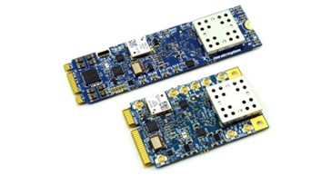

.. sectnum::

**IQ Player — porting guide for LimeSDR-Micro on imx8mp / imx95** 
+++++++++++++++++++++++++++++++++++++++++++++++++++++++++++++++++

Overview
********

The NXP LA9310 BSP provides support for the RFNM platform. To run IQ Player on other platforms, additional integration work is required. This document describes how to add support for LA9310 and IQ Player on new host platforms.
This guide provides an example of enabling the LimeSDR‑Micro M.2 board (LA9310 + LMS7002M) on the following NXP platforms FRDM-IMX8MPLUS and FRDM-IMX95

Hardware Requirements
*********************

FRDM-IMX8MPLUS or FRDM-IMX95 

- refer to https://www.nxp.com/design/design-center/development-boards-and-designs/frdm-development-boards:FRDM

limesdr-micro M.2 board

- refer to https://www.crowdsupply.com/lime-micro/limesdr-micro 

Hardware Setup
**************

.. image:: imx95-frdm_LimeSDR-Micro-board.png

LimeSDR-Micro official software environment
*******************************************

Lime Microsystems provides an official, productized software framework supporting various SDR software ecosystems such as GNU Radio, MATLAB, and OpenAirInterface.
This framework includes:

- Host drivers
- VSPA firmware source code
- Utilities to develop and customize applications for the LimeSDR‑Micro module

References:

- https://limesdr-micro.myriadrf.net/beta/
- https://github.com/myriadrf/LimeSuiteNG/tree/limesdr-micro

The LimeSDR‑Micro VSPA firmware is derived from IQ Player.
This porting guide uses the LimeSDR‑Micro module as a reference to explain how to:

- Modify the NXP BSP
- Port and enable IQ Player

This process applies to users developing new hardware based on i.MX8MP or i.MX95 with LA9310.

Software Components
*******************

The starting point is the standard NXP i.MX Linux BSP for i.MX8MP or i.MX95.
Two BSPs are availble at https://www.nxp.com/linux 

NXP Yocto BSP
https://www.nxp.com/design/design-center/software/embedded-software/i-mx-software/embedded-linux-for-i-mx-applications-processors:IMXLINUX

NXP Debian Linux BSP
https://www.nxp.com/design/design-center/software/embedded-software/linux-software-and-development-tools/nxp-debian-linux-sdk-distribution-for-i-mx-and-layerscape:NXPDEBIAN

Build BSP images for FRDM-IMX8MPLUS or FRDM-IMX95
*************************************************

Refer to the BSP user guide for instructions on building and deploying images for the selected target.
NXP also provides prebuilt images for the Yocto BSP. 

Example for Yocto 
.................

::

 git clone https://github.com/nxp-imx/imx-docker.git
 cd imx-docker/
 ./docker-build.sh Dockerfile-Ubuntu-22.04

::

  repo init -u https://github.com/nxp-imx/imx-manifest -b imx-linux-walnascar -m imx-6.12.34-2.1.0.xml
  cd imx-6.12.34-2.1.0/
  repo init -u https://github.com/nxp-imx/imx-manifest -b imx-linux-walnascar -m imx-6.12.34-2.1.0.xml
  repo sync

  MACHINE=imx8mp-lpddr4-frdm DISTRO=fsl-imx-xwayland source ./imx-setup-release.sh -b bld-xwayland

  MACHINE=imx95-15x15-lpddr4x-frdm DISTRO=fsl-imx-xwayland source ./imx-setup-release.sh -b bld-xwayland
  
  bitbake imx-image-core

Example for Debian
..................

::

 git clone https://github.com/NXP/flexbuild.git
 cd flexbuild
 . setup.env  (in host environment)
 bld docker   (create or attach to docker)
 . setup.env  (in docker environment)
 bld host-dep (install host dependent packages)

  bld -m imx8mpfrdm

  bld -m imx95frdm

Deployment sdcard using flex-installer on target or on laptop
::

  [root@fbdebian flexbuild-lf-6.6.52-2.2.0]$ ls build_lsdk2506/images/flex-installer
  $ flex-installer -r rootfs_lsdk_debian_xx_arm64.tar.zst -d /dev/sdx         (only install rootfs partition image)
  $ flex-installer -b boot_IMX_arm64_lts_xx.tar.zst -d /dev/sdx -m <machine>  (only install boot partition image)
  $ flex-installer -f firmware_<machine>_sdboot.img -d /dev/sdx -m <machine>  (only install composite firmware image)
  machine = imx8mpfrdm or imx95frdm

Add LA9310 support 
******************

To enable LA9310 support, the following software components must be modified or added:

- Linux kernel : Add patches for LA9310 support (PCI quirks, memory reservation in the device tree)

- la93xx_host_sw : Compile and deploy the LA9310 PCI driver (shiva)

- la93xx_firmware : Deploy LA9310 M4/FreeRTOS firmware and IQ Player VSPA firmware images

Linux Kernel Modifications
..........................

clone linux source code 
~~~~~~~~~~~~~~~~~~~~~~~

::

 git clone https://github.com/nxp-imx/linux-imx -b lf-6.12.y
 cd linux-imx

Workaround: Limited PCI Region Size on i.MX8MP
~~~~~~~~~~~~~~~~~~~~~~~~~~~~~~~~~~~~~~~~~~~~~~

.. note::
         Required only for i.MX8MP/DXL. Not needed on i.MX95.

.. code-block:: c

 diff --git a/drivers/pci/probe.c b/drivers/pci/probe.c
 index d9fc02a71baa..84793a6425c8 100644
 --- a/drivers/pci/probe.c
 +++ b/drivers/pci/probe.c
 @@ -208,6 +208,15 @@ int __pci_read_base(struct pci_dev *dev, enum pci_bar_type type,
          */
         if (sz == 0xffffffff)
                 sz = 0;
 +       /*
 +        * LA9310 device (0x1c12) BAR0 default size 256MB is too large for imx8
 +        * as workaround we map only first 64MB and we will update EP BAR0_MASK
 +        * at runtime before accessing BAR1-5 and avoid Bus Errors
 +        */
 +       if((sz<0xfc000000)&&( dev->device==0x1c12)&&(pos==0x10)){
 +               pci_info(dev,"reg 0x%x: forcing BAR0 readback 0x%08x to 0xfc000000 (i.e.64MB)\n",pos,sz);
 +               sz=0xfc000000;
 +       }

Workaround: Incorrect PCI Region Declaration on i.MX95
~~~~~~~~~~~~~~~~~~~~~~~~~~~~~~~~~~~~~~~~~~~~~~~~~~~~~~

.. code-block:: c

 diff --git a/arch/arm64/boot/dts/freescale/imx95.dtsi b/arch/arm64/boot/dts/freescale/imx95.dtsi
 index ae113e31a484..7452b1906d45 100644
 --- a/arch/arm64/boot/dts/freescale/imx95.dtsi
 +++ b/arch/arm64/boot/dts/freescale/imx95.dtsi
 @@ -2714,7 +2714,7 @@ pcie0: pcie@4c300000 {
                               <0 0x4c340000 0 0x4000>;
                         reg-names = "dbi", "config", "atu", "app";
                         ranges = <0x81000000 0x0 0x00000000 0x0 0x6ff00000 0 0x00100000>,
 -                                <0x82000000 0x0 0x10000000 0x9 0x10000000 0 0x10000000>;
 +                                <0x82000000 0x0 0x10000000 0x9 0x10000000 0 0x20000000>;
                         #address-cells = <3>;
                         #size-cells = <2>;
                         device_type = "pci";
 

Workaround: Initialize LA9310 PCI Class During Enumeration
~~~~~~~~~~~~~~~~~~~~~~~~~~~~~~~~~~~~~~~~~~~~~~~~~~~~~~~~~~

.. code-block:: c

 diff --git a/drivers/pci/quirks.c b/drivers/pci/quirks.c
 index a531064233f9..84e86ca15b76 100644
 --- a/drivers/pci/quirks.c
 +++ b/drivers/pci/quirks.c
 @@ -3592,6 +3592,23 @@ static void mellanox_check_broken_intx_masking(struct pci_dev *pdev)
  out:
         pci_disable_device(pdev);
  }
 +
 +/*
 + *  set NXP LA9310 device class code
 + */
 +static void quirk_la9310_cc(struct pci_dev *pdev)
 +{
 +       int i;
 +
 +       /* LA9310 devices do not have class code set when in PCIe boot mode */
 +       if (pdev->class == PCI_CLASS_NOT_DEFINED) {
 +               dev_info(&pdev->dev, "Setting PCI class for LA9310 PCIe device!\n");
 +               pdev->class = PCI_CLASS_NETWORK_OTHER;
 +       }
 +
 +}
 +DECLARE_PCI_FIXUP_EARLY(PCI_VENDOR_ID_FREESCALE, PCI_DEVICE_ID_LA9310, quirk_la9310_cc);
 +DECLARE_PCI_FIXUP_EARLY(PCI_VENDOR_ID_FREESCALE, PCI_DEVICE_ID_LA9310_DISABLE_CIP, quirk_la9310_cc);
  DECLARE_PCI_FIXUP_FINAL(PCI_VENDOR_ID_MELLANOX, PCI_ANY_ID,
                         mellanox_check_broken_intx_masking);
 
 diff --git a/include/linux/pci_ids.h b/include/linux/pci_ids.h
 index f0558e2a9359..21c745cc4b87 100644
 --- a/include/linux/pci_ids.h
 +++ b/include/linux/pci_ids.h
 @@ -2517,6 +2517,8 @@
  #define PCI_DEVICE_ID_MPC8641          0x7010
  #define PCI_DEVICE_ID_MPC8641D         0x7011
  #define PCI_DEVICE_ID_MPC8610          0x7018
 +#define PCI_DEVICE_ID_LA9310           0x1c10
 +#define PCI_DEVICE_ID_LA9310_DISABLE_CIP 0x1c12
 
  #define PCI_VENDOR_ID_PASEMI           0x1959
 
Add Reserved Memory for la93xx_host_sw
~~~~~~~~~~~~~~~~~~~~~~~~~~~~~~~~~~~~~~

.. code-block:: c

 diff --git a/arch/arm64/boot/dts/freescale/imx8mp-frdm.dts b/arch/arm64/boot/dts/freescale/imx8mp-frdm.dts
 index 2591abc42624..82156cd9cad6 100644
 --- a/arch/arm64/boot/dts/freescale/imx8mp-frdm.dts
 +++ b/arch/arm64/boot/dts/freescale/imx8mp-frdm.dts
 @@ -23,6 +23,19 @@ memory@40000000 {
                           <0x1 0x00000000 0 0xc0000000>;
         };
 
 +        reserved-memory {
 +                        la93: la93@92400000 {
 +                                reg = <0 0x92400000 0 0x4000000>;
 +                                compatible = "shared-dma-pool";
 +                        };
 +                        iqflood: iqflood@96400000 {
 +                                reg = <0 0x96400000 0 0xD000000>;
 +                                //compatible = "shared-dma-pool";
 +                                //no-map;
 +                                //compatible = "removed-dma-pool";
 +                        };
 +};
 +

 diff --git a/arch/arm64/boot/dts/freescale/imx95-15x15-frdm.dts b/arch/arm64/boot/dts/freescale/imx95-15x15-frdm.dts
 index 5fd60b653437..3dde7db09acf 100644
 --- a/arch/arm64/boot/dts/freescale/imx95-15x15-frdm.dts
 +++ b/arch/arm64/boot/dts/freescale/imx95-15x15-frdm.dts
 @@ -65,6 +65,17 @@ linux_cma: linux,cma {
                         linux,cma-default;
                 };
 
 +                la93: la93@a1000000 {
 +                         reg = <0 0xa1000000 0 0x4000000>;
 +                         compatible = "shared-dma-pool";
 +                };
 +                iqflood: iqflood@a5000000 {
 +                         reg = <0 0xa5000000 0 0xD000000>;
 +                         //compatible = "shared-dma-pool";
 +                         //no-map;
 +                         //compatible = "removed-dma-pool";
 +                };
 +
                 vpu_boot: vpu_boot@a0000000 {
                         reg = <0 0xa0000000 0 0x100000>;
                         no-map;
 
 
Compile Linux Kernel and Device Tree
~~~~~~~~~~~~~~~~~~~~~~~~~~~~~~~~~~~~
::

 cd linux-imx
 export CROSS_COMPILE=aarch64-linux-gnu-
 export ARCH=arm64
 make imx_v8_defconfig
 make -j$(nproc)
 make dtbs

Deploy Linux Image
~~~~~~~~~~~~~~~~~~

Replace kernel image and device tree on the target (example for eMMC deployment):
::

  arch/arm64/boot/dts/freescale/imx95-15x15-frdm.dtb
  arch/arm64/boot/dts/freescale/imx8mp-frdm-os08a20.dtb 
  arch/arm64/boot/Image 

  root@frdm:~# ls /run/media/boot-mmcblk1p1
  Image  imx95-15x15-frdm.dtb imx8mp-frdm-os08a20.dtb   

prepare kernel modules

::

  mkdir modules_install
  make INSTALL_MOD_PATH=./modules_install modules_install
  cd modules_install
  tar -czvf modules.tar.gz lib

Copy modules.tar.gz to the target root directory (/) and extract it.

la93xx_firmware (LA9310 FreeRTOS)
.................................

On the LimeSDR‑Micro board, additional clock initialization is required in the LA9310 boot flow. This is specific to LimeSDR‑Micro hardware.
Replace the default NXP LA9310 FreeRTOS image with the LimeSDR‑Micro‑specific firmware.

::

 git clone -b limesdr-micro https://github.com/myriadrf/LimeSuiteNG

 la93xx_freertos firmware can be found under 'firmware/limesdr-micro/la9310.bin'
 copy la9310.bin to the target /lib/firmware/la9310_dfe.bin  

 la93xx_freertos common headers can be found 'drivers/linux/la9310_limesdr/common_headers'
 This will be used for la93xx_host_sw compilation.

la93xx_host_sw
..............

Recompile the shiva driver against the newly built kernel.
::

 git clone  https://github.com/nxp-qoriq/la93xx_host_sw.git
 cd la93xx_host_sw
 git checkout -b imx-la93xx-1.0 imx-la93xx-1.0
 git submodule update --init

 export KERNEL_DIR=<path to linux>
 export LA9310_COMMON_HEADERS=< path to la93xx_freertos/common_headers>
 export LA9310_DRV_HEADER_DIR=< path to la93xx_host_sw/kernel_driver/la9310sdr>
 export CROSS_COMPILE=aarch64-linux-gnu-
 export ARCH=arm64
 make clean
 CONFIG_ENABLE_FLOAT_BYPASS=y make IMX_SDR=1 

copy la9310shiva.ko to:
::

 /lib/modules/$(uname -r)/extra/ 

IQ Player
.........

Compile and deploy iqplayer firmware and utilities

Default VSPA tools path:
::

 VSPA_TOOL ?= /opt/VSPA_Tools_vbeta_14_00_781

::

 make
 make install
 scp -r install/* root@<targetIP>:/

Testing 
*******

load and start VSPA firmware
::

 ./load-nlm.sh

confugre LimeRF using LimeSuiteNG freeRTOS CLI (if available)

play (repeat) waveform from file
::

 ./iq-replay.sh ./tone_td_3p072Mhz_20ms_4KB1200_2c.bin 1200

capture (one time) iq samples into file
::

 ./iq-capture.sh ./iqdata.bin 1200

capture (repeat) in DDR buffer
::

 ./iq-capture-ddr.sh 1200
 ./iq-stop.sh

